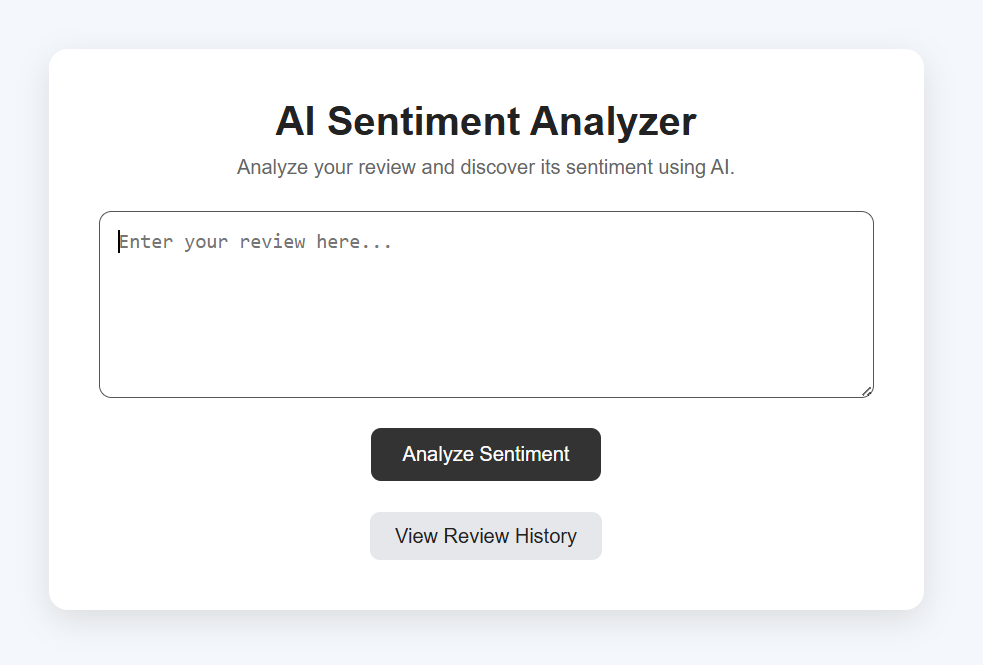
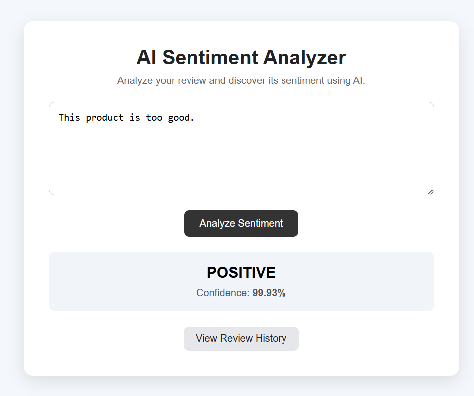
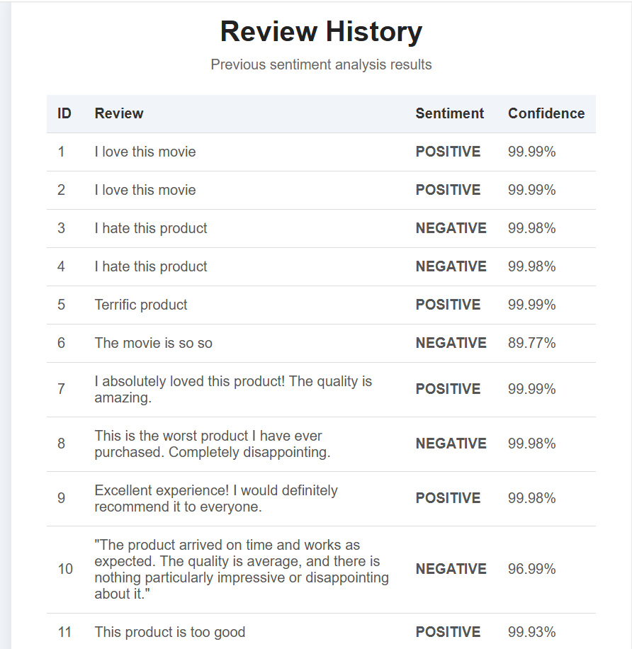
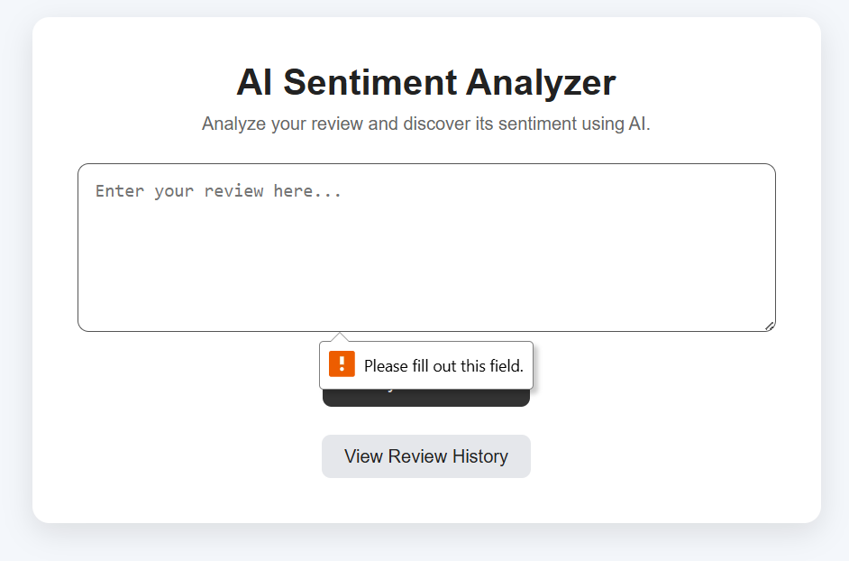

# 🤖 AI-Based Sentiment Analyzer

An AI-powered web application that analyzes user reviews and determines their sentiment using a pre-trained Transformer model from Hugging Face.

The application classifies reviews as **POSITIVE** or **NEGATIVE**, displays the model's confidence score, and stores analyzed reviews in a local SQLite database for viewing in the review history.

## 📌 Project Overview

The AI-Based Sentiment Analyzer allows users to enter a product or movie review through a web interface.

The review is processed using a pre-trained Transformer model, which returns:

* Sentiment label
* Confidence score

The result is displayed on the website and simultaneously stored in an SQLite database.

Users can then view their previous analyses through the **Review History** page.

## ✨ Features

* 🤖 AI-based sentiment analysis
* 🟢 Positive sentiment detection
* 🔴 Negative sentiment detection
* 📊 Confidence score displayed as a percentage
* 💾 Review storage using SQLite
* 📜 Review history page
* 🌐 Flask-based web application
* 🎨 Clean and user-friendly interface
* ⚠️ Empty review validation

## 🛠️ Technologies Used

* **Python**
* **Flask**
* **Hugging Face Transformers**
* **PyTorch**
* **SQLite**
* **HTML**
* **CSS**

## 🧠 AI Model

This project uses the pre-trained Hugging Face Transformer model:

`distilbert-base-uncased-finetuned-sst-2-english`

The model performs **binary sentiment classification**:

* **POSITIVE**
* **NEGATIVE**

> **Note:** The current model does not provide a separate NEUTRAL class. Therefore, neutral-style reviews are classified into either POSITIVE or NEGATIVE.

## 🔄 Application Workflow

```text
User enters a review
        ↓
Flask receives the review
        ↓
Hugging Face Transformer analyzes the review
        ↓
Sentiment + confidence score generated
        ↓
Result displayed on the website
        ↓
Review and result stored in SQLite
        ↓
Review available in History
```

## 📂 Project Structure

```text
AI_Based_Sentiment_Analyzer/
│
├── app.py
├── requirements.txt
├── README.md
├── .gitignore
│
├── templates/
│   ├── index.html
│   └── history.html
│
├── static/
│   └── style.css
│
└── screenshots/
    ├── main-page.png
    ├── sentiment-result.png
    ├── review-history.png
    └── empty-review-validation.png
```

## ⚙️ Installation & Setup

### 1. Clone the repository

```bash
git clone https://github.com/RiyaSharma-tech/Codec_Projects.git
```

### 2. Navigate to the project folder

```bash
cd Codec_Projects
cd AI_Based_Sentiment_Analyzer
```

### 3. Install the required packages

```bash
pip install -r requirements.txt
```

### 4. Run the Flask application

```bash
python app.py
```

### 5. Open the application

Open the following address in your browser:

`http://127.0.0.1:5000`

The SQLite database will be created automatically when the application is started.

## 💾 Database

The application uses **SQLite** to store analyzed reviews.

The database contains the following fields:

| Field        | Description                |
| ------------ | -------------------------- |
| `id`         | Unique ID of the review    |
| `review`     | Review entered by the user |
| `sentiment`  | Predicted sentiment        |
| `confidence` | Model confidence score     |

The local database file `sentiment.db` is excluded from the GitHub repository because it contains locally generated test data.

## 📸 Screenshots

### Main Page

The main page allows the user to enter a review and analyze its sentiment.



### Sentiment Analysis Result

The application displays the predicted sentiment and confidence percentage after analysis.



### Review History

Previously analyzed reviews are stored in SQLite and displayed on the history page.



### Empty Review Validation

The application prevents the user from submitting an empty review.



## 🧪 Testing

The application was tested with:

* Positive reviews
* Negative reviews
* Neutral-style reviews
* Multiple reviews
* Review history persistence
* Empty review submission
* Application restart and database persistence

## 🎯 Learning Outcomes

Through this project, I gained practical experience with:

* Python web development
* Flask routing and templates
* Natural Language Processing
* Hugging Face Transformers
* Pre-trained AI models
* SQLite database operations
* HTML and CSS
* Jinja templating
* GitHub project organization

## 🎯 Internship

This project was developed as part of the **Codec Technologies Python Developer Internship**.

## 👩‍💻 Author

**Riya Sharma**

```
```

