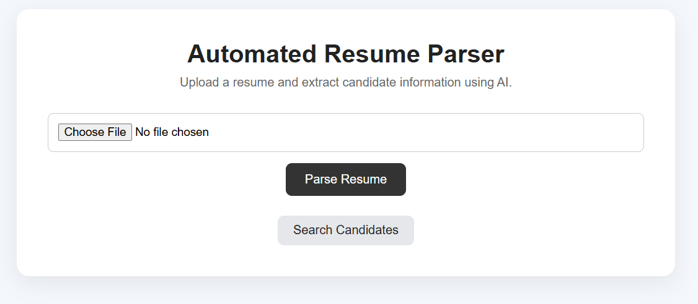
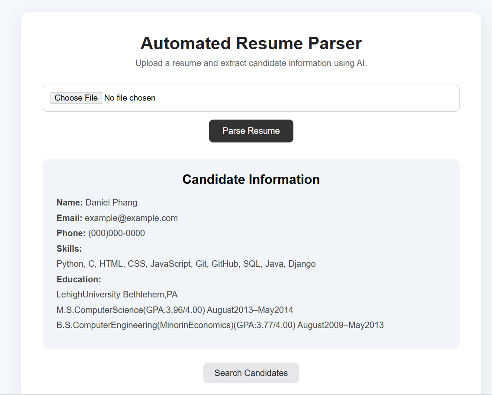
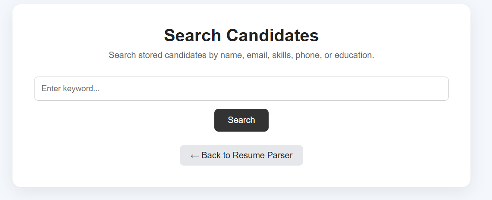
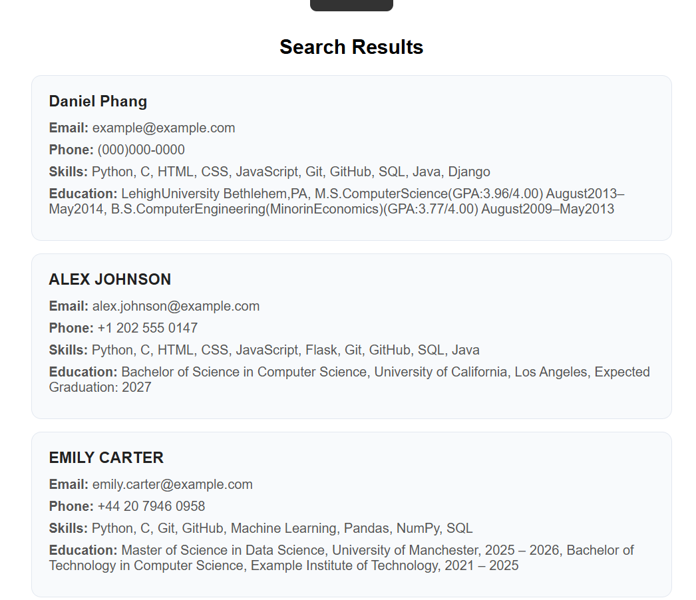

# 📄 Automated Resume Parser

An AI-assisted web application that automatically extracts important candidate information from PDF resumes and stores the extracted data in a searchable SQLite database.

The application extracts details such as **name, email, phone number, technical skills, and education** from uploaded resumes.

## 📌 Project Overview

The Automated Resume Parser allows users to upload a PDF resume through a web interface.

The resume is processed and the application extracts:

* Candidate name
* Email address
* Phone number
* Technical skills
* Education information

The extracted candidate information is displayed on the website and simultaneously stored in an SQLite database.

Users can also search previously stored candidates using keywords.

## ✨ Features

* 📤 PDF resume upload
* 📖 PDF text extraction using PDFPlumber
* 👤 Candidate name extraction
* 📧 Email extraction
* 📱 Phone number extraction
* 🛠️ Technical skill extraction
* 🎓 Education extraction
* 💾 Candidate information storage using SQLite
* 🔄 Duplicate candidate prevention
* 🔎 Candidate search functionality
* 🌐 Flask-based web application
* 🎨 Clean and user-friendly interface
* ⚠️ Handles missing information gracefully

## 🛠️ Technologies Used

* **Python**
* **Flask**
* **PDFPlumber**
* **spaCy**
* **SQLite**
* **HTML**
* **CSS**

## 🧠 Resume Information Extraction

The application processes uploaded PDF resumes and extracts structured candidate information.

The extraction process includes:

* **Name** — Candidate's full name
* **Email** — Email address detected from the resume
* **Phone** — Phone number detected using pattern matching
* **Skills** — Technical skills identified from the resume
* **Education** — Educational qualifications identified using education-related keywords

> **Note:** Resume formats can vary significantly. Therefore, extraction accuracy may depend on the structure and content of the uploaded resume.

## 🔄 Application Workflow

**PDF Resume → Text Extraction → Information Extraction → Candidate Information → SQLite Database → Candidate Search**

## 📂 Project Structure

    Automated_Resume_Parser/
    │
    ├── app.py
    ├── parser.py
    ├── db.py
    ├── extract_text.py
    ├── search_candidates.py
    ├── requirements.txt
    ├── README.md
    ├── .gitignore
    │
    ├── templates/
    │   ├── index.html
    │   └── search.html
    │
    ├── static/
    │   └── style.css
    │
    ├── screenshots/
    │   ├── main_page.png
    │   ├── parsed_resume.png
    │   ├── search_page.png
    │   └── search_results.png
    │
    ├── resumes/
    └── uploads/

> The resumes/ and uploads/ folders are used locally for resume files and uploaded files. Their contents are excluded from the GitHub repository using .gitignore.

## ⚙️ Installation & Setup

### 1. Clone the repository

git clone https://github.com/RiyaSharma-tech/Codec_Projects.git

### 2. Navigate to the project folder

cd Codec_Projects
cd Automated_Resume_Parser

### 3. Install the required packages

pip install -r requirements.txt

### 4. Install the spaCy English language model

python -m spacy download en_core_web_sm

### 5. Run the Flask application

python app.py

### 6. Open the application

Open the following address in your browser:

http://127.0.0.1:5000

The SQLite database will be created automatically when the application is started.

## 💾 Database

The application uses **SQLite** to store extracted candidate information.

The database contains the following fields:

| Field | Description |
|---|---|
| `id` | Unique candidate ID |
| `name` | Candidate name |
| `email` | Candidate email address |
| `phone` | Candidate phone number |
| `skills` | Extracted technical skills |
| `education` | Extracted education information |

If a candidate with the same email already exists, the existing record is updated instead of creating a duplicate record.

> **Note:** The local SQLite database file is excluded from the GitHub repository because it contains locally generated candidate data.

## 📸 Screenshots

### Main Resume Parser Page

The main page allows the user to upload a PDF resume and start the parsing process.

### Resume Parsing Result

The application displays the candidate information extracted from the uploaded resume.

### Candidate Search Page

The search page allows users to search stored candidates using keywords.

### Search Results

The application displays candidates matching the entered search keyword.

## 🧪 Testing

The application was tested with:

* Different PDF resumes
* Different phone number formats
* Missing phone numbers
* Different education formats
* Multiple technical skills
* Multiple candidate records
* Duplicate candidate uploads
* Candidate search
* SQLite database persistence
* Application restart
* Demo resumes with different layouts

## 🎯 Learning Outcomes

Through this project, I gained practical experience with:

* Python programming
* Flask web development
* PDF text extraction
* Natural Language Processing
* spaCy
* Regular expressions
* SQLite database operations
* Candidate information extraction
* Jinja templating
* HTML and CSS
* GitHub project organization

## 🔮 Future Enhancements

Possible future improvements include:

* PostgreSQL database integration
* MongoDB database support
* DOC/DOCX resume parsing
* Improved NLP-based information extraction
* Advanced skill categorization
* Resume ranking and candidate scoring
* Automatic resume classification
* Authentication and user accounts
* Admin dashboard
* CSV/Excel candidate export
* Cloud deployment

## 🎯 Internship

This project was developed as part of the **Codec Technologies Python Developer Internship**.

## 👩‍💻 Author

**Riya Sharma**

B.Tech Computer Science Engineering Student
